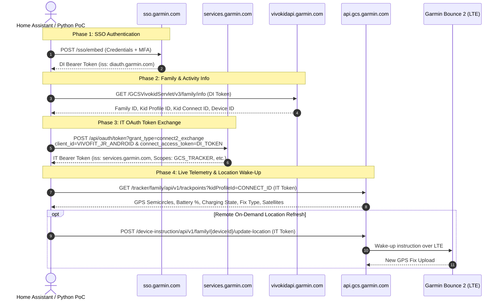

# Reverse Engineering Garmin Bounce 2 & Garmin Jr. APIs

A comprehensive technical teardown of the Garmin Jr. Android application (`com.garmin.android.apps.vivokid`), uncovering the authentication mechanisms, backend architecture, and REST API endpoints powering the **Garmin Bounce 2** LTE kid watch.

---

## 1. Legal Context: Is Reverse Engineering Allowed?

**Yes.** Reverse engineering for the purpose of achieving interoperability between independently created software (such as connecting your Garmin Bounce 2 to Home Assistant) is explicitly protected under both European and United States law:

### European Union: Directive 2009/24/EC (Article 6 - Decompilation)
Under **Article 6 of the EU Computer Programs Directive (2009/24/EC)**:
> *(1) The authorization of the rightholder shall not be required where reproduction of the code and translation of its form [...] are indispensable to obtain the information necessary to achieve the **interoperability** of an independently created computer program with other programs, provided that:*
> - *These acts are performed by the licensee or by another person having a right to use a copy of a program.*
> - *The information necessary to achieve interoperability has not previously been readily available.*
> - *These acts are confined to the parts of the original program which are necessary to achieve interoperability.*

Furthermore, **Article 5(3)** guarantees that a legitimate user is entitled to observe, study, or test the functioning of the program to determine the underlying ideas and principles.

### United States: 17 U.S.C. § 1201(f) (Reverse Engineering Exemption)
Under the **Digital Millennium Copyright Act (DMCA), 17 U.S.C. § 1201(f)**:
> A person who has lawfully obtained the right to use a copy of a computer program may circumvent technological measures for the sole purpose of identifying and analyzing elements of the program that are necessary to achieve interoperability of an independently created computer program with other programs.
>
> *(Established landmark precedents: **Sega Enterprises Ltd. v. Accolade, Inc.** and **Sony Computer Entertainment, Inc. v. Connectix Corp.**)*

### Practical Boundary
- We do **not** bypass copyright encryption or digital rights management (DRM) for piracy.
- We communicate exclusively over standard, legitimate HTTPS REST interfaces.
- Authentication utilizes your own personal Garmin account credentials to access data from your own hardware.
- The project is non-commercial, open-source, and created strictly for smart home interoperability.

---

## 2. Architecture & Backend Topology

The Garmin Jr. ecosystem differs fundamentally from standard Garmin Connect wearables (Fenix, Forerunner, Venu). The Bounce 2 communicates over an active eSIM LTE-M network with Garmin Cloud Services (GCS).



### The Dual-Backend Split
1. **`vivokidapi.garmin.com`**:
   - Host for family structures, child accounts, chores, step challenges, and LTE subscription billing status.
   - Authorized via the standard **Garmin Connect Mobile DI Token** (`Authorization: Bearer <di_token>`).
   - Does **not** require strict mobile device WAF checks.
2. **`api.gcs.garmin.com`**:
   - Host for real-time tracking, GPS coordinates, geofences, and remote LTE device instructions.
   - Protected by Cloudflare WAF and strict JWT issuer validation.
   - **Crucial discovery:** It **rejects** DI tokens (`iss: https://diauth.garmin.com`) with `HTTP 401 Invalid Issuer`. It strictly requires an **IT OAuth Token** (`iss: https://services.garmin.com`).

---

## 3. The Missing Link: IT OAuth Token Exchange

When decompiling the APK's mobile authentication library (`smali_classes4/g6/e.smali`, `i6/b.smali`, `l6/c.smali`), we discovered the internal exchange mechanism:

```http
POST https://services.garmin.com/api/oauth/token?grant_type=connect2_exchange HTTP/1.1
Host: services.garmin.com
User-Agent: GarminJr/5.23 (Android)
Content-Type: application/x-www-form-urlencoded
Accept: application/json

client_id=VIVOFIT_JR_ANDROID&connect_access_token=<YOUR_DI_TOKEN>
```

### Response (HTTP 200 OK):
```json
{
  "access_token": "ic201jyr-hiu6-h5kv-6lvy-gly80ssh3k3u",
  "token_type": "Bearer",
  "expires_in": 7776000,
  "scope": "CSE_CDS_ACCOUNT_READ GCS_FAMILY_TRACKER_CREATE GCS_FAMILY_TRACKER_READ GCS_DEVICE_INSTRUCTION_CREATE GCS_MESSAGING_FAMILY_CREATE GCS_MESSAGING_FAMILY_READ YAR_BILLING_SUBSCRIBER_READ",
  "refresh_token": "271h24c4-zu1m-htsg-6a09-u1ywtd3b54au",
  "customerId": "b9423e01-73e4-4830-82b0-4ed1ee64caa2"
}
```

Notice the granted scopes:
- `GCS_FAMILY_TRACKER_READ`: Grants read access to GPS coordinates and battery telemetry.
- `GCS_DEVICE_INSTRUCTION_CREATE`: Grants permission to send LTE commands to the watch.
- `GCS_MESSAGING_FAMILY_CREATE / READ`: Text and audio messaging with the watch.

---

## 4. GPS Coordinates: Semicircles Conversion

Garmin GPS firmware records coordinates as **32-bit signed integers (semicircles)** rather than floating-point degrees. Semicircles divide the $180^\circ$ hemisphere into $2^{31}$ discrete units.

### Mathematical Conversion Formula
$$\text{degrees} = \text{semicircles} \times \left(\frac{180.0}{2^{31}}\right) = \text{semicircles} \times 8.381903171539307 \times 10^{-8}$$

### Python Implementation
```python
def semicircles_to_degrees(semicircles: int) -> float:
    if semicircles is None:
        return 0.0
    return round(semicircles * (180.0 / 2**31), 6)

# Example:
# lat = 626749964  -> 626749964 * (180 / 2**31) = 52.520008° N
# lon = 159987820  -> 159987820 * (180 / 2**31) = 13.404954° E
```

---

## 5. API Reference Catalog

### 1. Family & Kids Information
- **URL**: `GET https://vivokidapi.garmin.com/GCSVivokidServlet/v3/family/info`
- **Auth**: `Authorization: Bearer <DI_TOKEN>`
- **Response**:
```json
{
  "guardianId": 10000001,
  "families": [
    {
      "familyId": 12345678,
      "name": "Mustermann",
      "guardians": [...],
      "kids": [
        {
          "id": 20000001,
          "name": "Mia",
          "connectId": 30000001,
          "deviceId": "9876543210",
          "devicePartNumber": "006-B4745-00",
          "hasLteDevice": true,
          "stepsRecord": 12500
        }
      ]
    }
  ]
}
```

> [!NOTE]
> Each child profile has **two distinct IDs**:
> - `id` (e.g. `20000001`): Used for **Vivokid activity summaries**.
> - `connectId` (e.g. `30000001`): Used for **GCS tracker trackpoints** (passed as parameter `kidProfileId`).

---

### 2. LTE Subscription Status
- **URL**: `GET https://vivokidapi.garmin.com/contact-service/subscription/status?deviceId={deviceId}&familyId={familyId}`
- **Auth**: `Authorization: Bearer <DI_TOKEN>`
- **Response**:
```json
{
  "status": "ACTIVE",
  "activeForThisFamily": true,
  "subscriptionExpireDate": null
}
```

---

### 3. Daily Activity & Steps
- **URL**: `GET https://vivokidapi.garmin.com/GCSVivokidServlet/v2/activity/summary/kid/{kidId}/{YYYY-MM-DD}`
- **Auth**: `Authorization: Bearer <DI_TOKEN>`
- **Response**:
```json
{
  "kidId": 20000001,
  "steps": 8500,
  "stepsRecord": 12500,
  "stepsGoal": 8000,
  "lastSyncDate": 1790116431000,
  "calendarDate": "2026-09-22"
}
```

---

### 4. GPS Trackpoints & Telemetry
- **URL**: `GET https://api.gcs.garmin.com/tracker/family/api/v1/trackpoints?kidProfileId={connectId}&begin={ISO8601}&limit=10`
- **Auth**: `Authorization: Bearer <IT_TOKEN>`
- **Response**:
```json
[
  {
    "dateTime": "2026-09-16T13:09:14.000Z",
    "reportedTime": "2026-09-16T13:09:16.310Z",
    "position": {
      "lat": 626749964,
      "lon": 159987820
    },
    "fixType": "WFPS_ANCHOR",
    "accuracy": 25,
    "satelliteCount": 18,
    "batteryLevel": 85,
    "familyPointData": {
      "deviceId": "9876543210",
      "statusChanges": [
        {
          "deviceState": "GEOFENCE_EXIT",
          "geofenceId": 100001
        }
      ],
      "deviceSignalStrength": {
        "gpsStrength": 0,
        "wifiStrength": 0,
        "cellTowerStrength": 0
      }
    }
  }
]
```

#### Fix Types
- `GPS`: Traditional satellite fix.
- `WFPS`: Wi-Fi Positioning System (lookup against nearby BSSID hotspots).
- `WFPS_ANCHOR`: Geofenced fixed Wi-Fi home/school base anchor.

---

### 5. On-Demand Location Refresh (LTE Wake-Up Ping)
- **URL**: `POST https://api.gcs.garmin.com/device-instruction/api/v1/family/{deviceId}/update-location`
- **Auth**: `Authorization: Bearer <IT_TOKEN>`
- **Payload**: None (empty body)
- **Response**: `HTTP 200 OK`
- **Behavior**: Garmin servers send an MQTT push notification to the watch via LTE. The watch powers on its GNSS chip, calculates coordinates, and pushes a fresh trackpoint back to GCS.

---

### 6. Messaging & Chat History (GCS Messaging Service)
- **Read Messages**: `GET https://api.gcs.garmin.com/messaging/family/api/v1/guardian/messages?after={ISO8601}&limit=50&audioMediaType=audio/ogg`
  - **Auth**: `Authorization: Bearer <IT_TOKEN>`
  - **Response (HTTP 200 OK)**:
```json
{
  "messages": [
    {
      "messageId": "15cd89e5-080b-4c87-a6fb-12b4136dfc67",
      "type": "USER",
      "mediaType": "text/plain",
      "fromUserProfilePk": 30000001,
      "toUserProfilePk": 10000001,
      "messageText": "Hallo Mama!",
      "createDateTime": "2026-09-23T13:23:43.132Z",
      "deliveryReceipt": "2026-09-23T13:23:44.123Z"
    }
  ]
}
```

- **Send Direct Message to Watch**: `POST https://api.gcs.garmin.com/messaging/family/api/v1/messages/user/text`
  - **Auth**: `Authorization: Bearer <IT_TOKEN>`
  - **Payload**:
```json
{
  "messageId": "UUID4_STRING",
  "mediaType": "text/plain",
  "messageText": "Essen ist fertig!",
  "toUserProfilePk": 30000001
}
```
  - **Response**: `HTTP 201 Created`

- **Send Message to Family Group Chat**: `POST https://api.gcs.garmin.com/messaging/family/api/v1/messages/family/text`
  - **Auth**: `Authorization: Bearer <IT_TOKEN>`
  - **Payload**:
```json
{
  "messageId": "UUID4_STRING",
  "mediaType": "text/plain",
  "messageText": "Hallo Familie!"
}
```
  - **Response**: `HTTP 201 Created`

---

### 7. Voice Messages (Audio / Ogg Opus)
- **Download Voice Recording**: `GET https://api.gcs.garmin.com/messaging/family/api/v1/messages/{messageId}/content`
  - **Auth**: `Authorization: Bearer <IT_TOKEN>`
  - **Response**: `HTTP 200 OK` (Content-Type: `audio/ogg`, raw Opus audio payload)
- **Send Voice Recording**: `POST https://api.gcs.garmin.com/messaging/family/api/v1/messages/user/file?messageId={UUID}&toUserProfilePk={connectId}&locale=de`
  - **Auth**: `Authorization: Bearer <IT_TOKEN>`
  - **Body**: Multipart form with part named `audio` (`audio/ogg`)
  - **Response**: `HTTP 201 Created`

